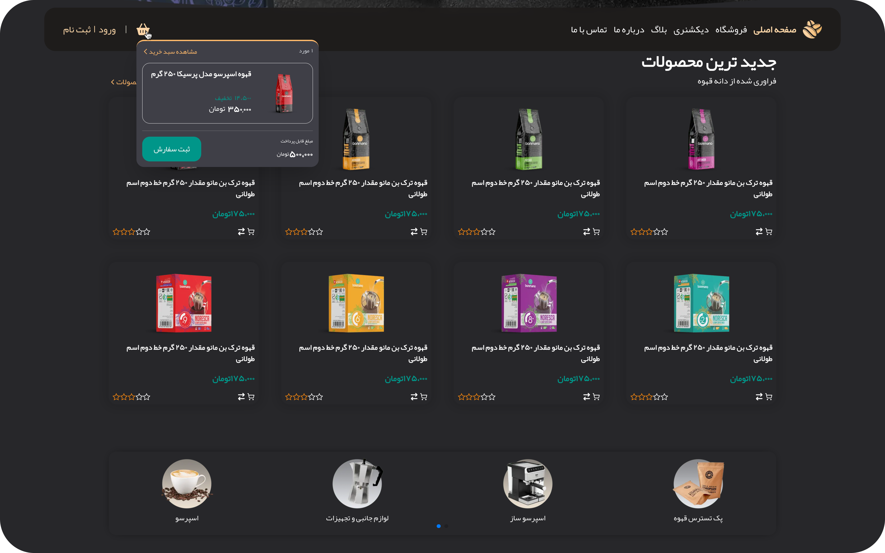
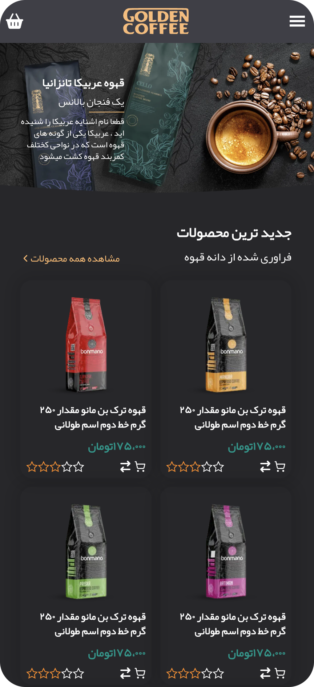
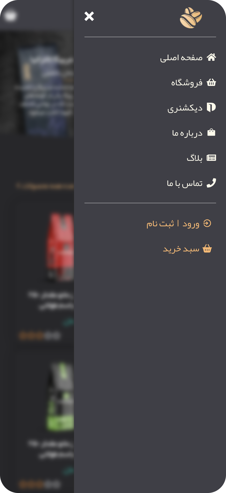
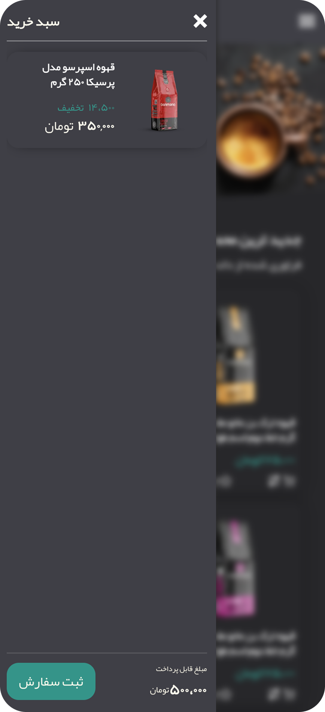

<h1 align="center">☕️ Caffee shop</h1>

<br/>
<br/>
<br/>
 

## 🌐 Live Demo  
[Open the Live Website](https://coffee-shop-two-psi.vercel.app/)


<br/>
<br/>


## 📄 Description

The coffee shop project is my first project
"This project was developed with NextJs, but I still haven't learned NextJs!"


<br/>
<br/>


## 📘 Project Description

This is my **first personal project**, built with **Next.js**, even though I haven't formally learned the framework yet. The goal was to explore web development hands-on and practice building a simple coffee shop management app.  
I'm still learning, and this project is part of my journey. 


<br/>
<br/>


## ✨ Features

- Simple order-taking system
- Responsive design
- First personal project
- Mobile view support
- Sidebar 
- Dark mode (Considering the user's browser theme)
- Loading spinner


<br/>
<br/>


## 📦 Installation & Usage

###### Requirements 
- Node.js 
- npm or yarn


###### Installation Steps 

1. Clone the project 
```bash
git clone https://github.com/Kaveh-Khorshidi/Coffee-Shop.git
```

3. Move into the project directory
```bash
cd Coffee-Shop
```

5. Install dependencies
```bash
npm install
```

7. Start the development server
```bash
npm run dev
```


<br/>
<br/>


## ⚙️ Tech Stack

- React.js
- Next.js
- Tailwind CSS


<br/>
<br/>


## 🎯 Project Goals
- Practice building a simple app using Next.js and Tailwind CSS  


<br/>
<br/>


## 📌 TODO (Next Steps)

- [ ] Add DarkMode Botton
- [ ] Add unit testing (using Vitest or Jest)


<br/>
<br/>


## ⚖️ License
This project is licensed under the MIT License.


<br/>
<br/>


## 🧪 Testing
This project currently does not include any automated tests. However, I plan to add testing in the future using either **Vitest** or **Jest**.


<br/>
<br/>


## 🌌 ScreenShot
###### Desktop


<br/>



<br/>


###### Mobile
<table>
  <tr>
    <td></td>
    <td></td>
    <td></td>
  </tr>
</table>


<br/>
<br/>


<h3 align="center">

<a href="https://github.com/Kaveh-Khorshidi" >
"Developed  by  Kaveh Khorshidi"
</a>

</h3>


