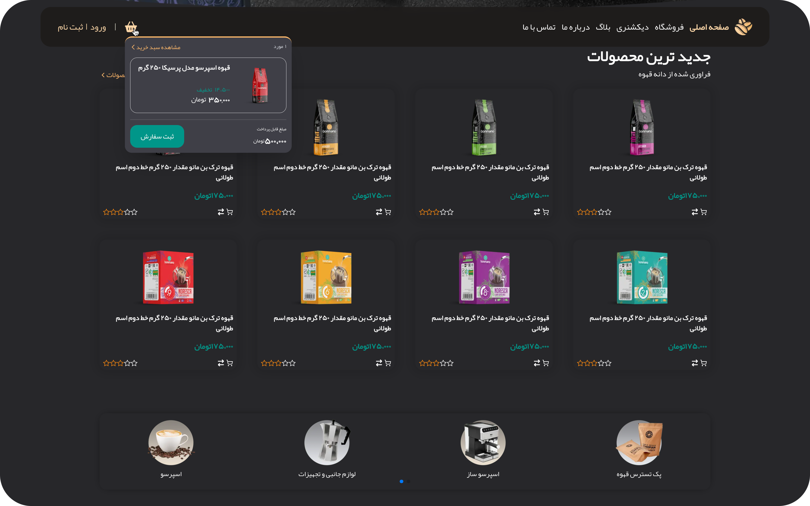
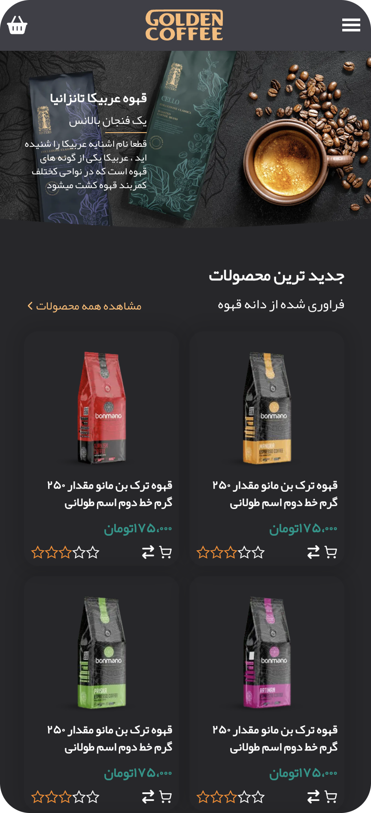
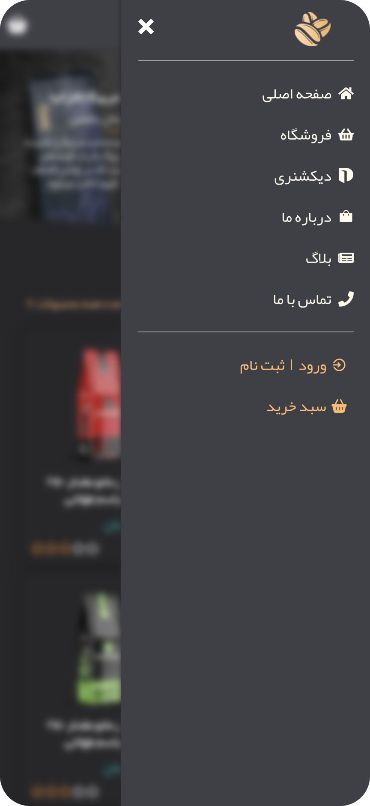
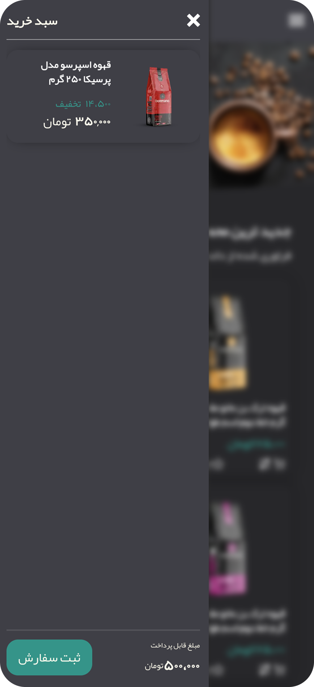

<h1 align="center">Coffee Shop</h1>
<p align="center">  Simple Coffee Shop UI built with Next.js and Tailwind CSS.</p>


<br/>
<br/>
 

## Live Demo  
[Open the Live Website](https://coffee-shop-two-psi.vercel.app/)


<br/>


## Description

The goal was to explore web development hands-on and practice building a simple coffee shop management app.  
This project was built to practice Next.js and improve frontend development skills.


<br/>


## Features

- Simple order-taking system
- Responsive design
- Mobile view support
- Sidebar
- Automatic dark mode based on the user's system preference
- Loading spinner


<br/>


## Screenshots
###### Desktop


<br/>



<br/>


###### Mobile
<table>
  <tr>
    <td></td>
    <td></td>
    <td></td>
  </tr>
</table>


<br/>


## Tech Stack

- Next.js
- React
- Tailwind CSS
- JavaScript


<br/>


## Installation & Usage

###### Requirements 
- Node.js 18+
- npm or yarn


###### Installation Steps 

1. Clone the project 
```bash
git clone https://github.com/Kaveh-Khorshidi/Coffee-Shop.git
```

2. Move into the project directory
```bash
cd Coffee-Shop
```

3. Install dependencies
```bash
npm install
```

###### Usage Steps

Start the development server
```bash
npm run dev
```

<br/>


## Project Goals

- Practice building applications with Next.js
- Improve frontend development skills
- Learn Tailwind CSS


<br/>


## TODO (Next Steps)

- [ ] Add a manual dark mode toggle
- [ ] Add unit testing (using Vitest or Jest)


<br/>


## License

This project is licensed under the MIT License.


<br/>


## Author

**Kaveh Khorshidi**

[](https://github.com/kavehkhorshidiii)

[](mailto:kavehkhorshidiii@gmail.com)


